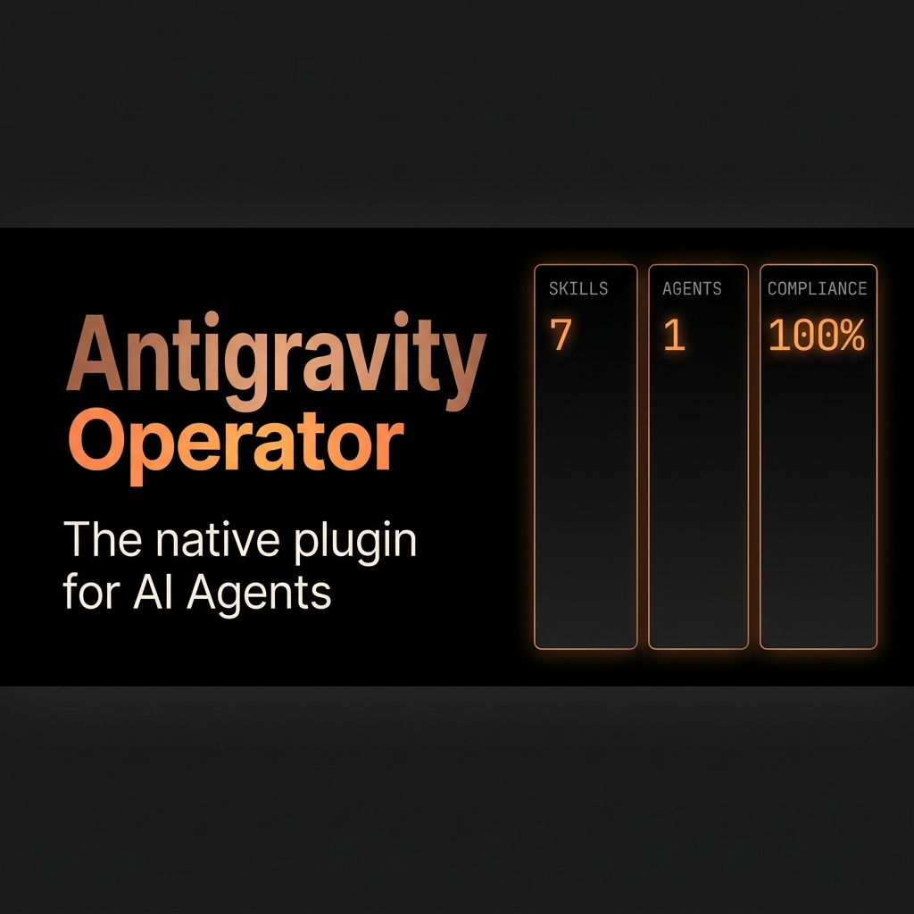

<p align="center">
  
</p>

# Antigravity Operator

An ECC-inspired, performance-optimized, native plugin for **Antigravity**. 
This plugin supercharges your AI agent by injecting strict rules, Test-Driven Development (TDD) instincts, and dedicated security review workflows. No hacks, no workarounds—just native Antigravity skills.

## Features
- **TDD Workflow (`tdd-workflow`)**: Forces the agent to always write failing tests before implementing production code, ensuring 100% reliability.
- **Security Reviewer (`security-reviewer`)**: An expert sub-persona that systematically reviews code for SQL injections, XSS, configuration errors, and best practices.

## Installation

Since this plugin is built natively for Antigravity, installation is as simple as cloning this repository into your Antigravity plugins folder:

```bash
cd ~/.gemini/config/plugins/
git clone https://github.com/votre-pseudo/antigravity-operator.git
```

Once cloned, Antigravity will automatically load these skills and apply them to your workflow!

## Contributing
Contributions are welcome. If you want to port more ECC instincts (like architecture planning or dead code cleanup) into Antigravity, simply create a new folder under `skills/` with a valid `SKILL.md` file.

## License
MIT License
